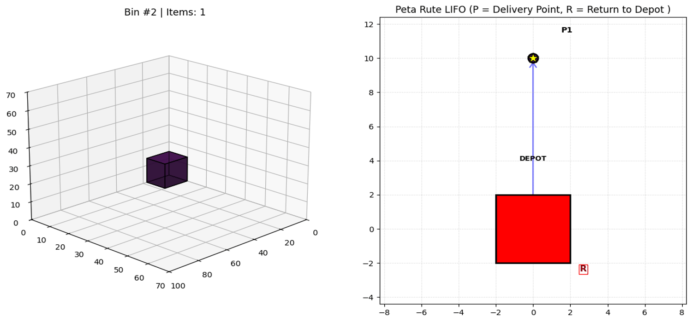
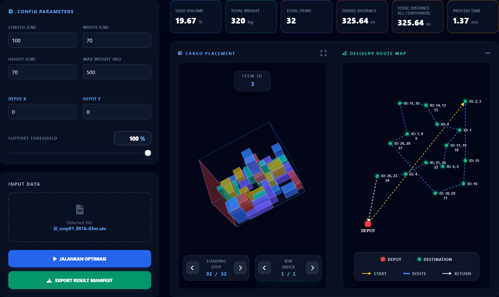

# 3L-CVRP-DRL: 3D Loading & Vehicle Routing Optimizer

The 3L-CVRP-DRL program is a logistics solution designed to tackle the Three-Dimensional Loading Capacitated Vehicle Routing Problem (3L-CVRP). By integrating 3D cargo space optimization with distribution route planning, this model aims to solve complex modern logistics challenges faster than conventional methods.  

The core of this program features a Deep Reinforcement Learning (DRL) model using the Maskable Proximal Policy Optimization (MPPO) algorithm with a hybrid CNN-GNN architecture.



For inference, the trained model is used in a web-based interface or a localhost environment that serves as a user-friendly platform for logistics management, allowing users to upload shipment manifests in CSV format and optimize the delivery. This integrated platform provides 3D visualizations for inspecting cargo placement with step-by-step loading, route mapping that ensures adherence to Last-In, First-Out (LIFO) principles, and a analytics dashboard displaying KPIs such as volume utilization, travel distance, total weight, etc. 



## Localhost Installation Guide using Anaconda Prompt

### 1. Open Anaconda Prompt

### 2. Create Python Environment
```
conda create --name lcvrp python=3.10
conda activate lcvrp
```

### 3. Create New Folder
```
mkdir C:\LCVRP
cd C:\LCVRP
```

### 4. Clone Github
```
git clone https://github.com/benevito.535220222/3L-CVRP-DRL.git
```

### 5. Install the Required Library
```
pip install -r requirements.txt
```

### 6. Run the Program
```
& "C:\Users\{USER}\miniconda3\envs\lcvrp\python.exe" website/app.py
```

### 7. Open Browser
```
http://127.0.0.1:5000/
```